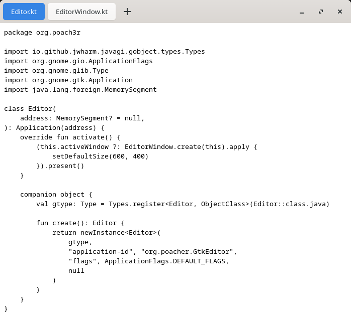

YATVE (Yet Another Text View Editor) is a simplistic GTK4 text editor written to better understand the Java-GI library.

# Keybinds
| Combination | Effect                             |
|-------------|------------------------------------|
| Ctrl + N    | Creates a new buffer               |
| Ctrl + O    | Opens a file in the current buffer |
| Ctrl + R    | Closes the current buffer          |
| Ctrl + S    | Saves the current buffer           |
| Ctrl + 1-9  | Goes to the specified buffer       |